# Munro Maps + Mermaid.IO









```text
graph BT

subgraph horizon 1
  Now[The Now House]
  Initative1((Initative 1))
  InitativeA((Initative A))
end
subgraph horizon 1
Initative2((Initative 2))
Initative3((Initative 3))
Initative4((Initative 4))
Milestone1>Milestone 1]
end 
subgraph horizon 3
Initative5((Initative 5));
Milestone2>Milestone 2]
Goal((fa:fa-flag))
end 

Now -->Initative1
Now --> InitativeA
InitativeA --> Initative4
InitativeA -. Before .- Initative2
Initative1 --> Initative2
Initative2 -.-> Milestone1
Initative2 --> Initative3
Initative2 --> Initative4
Initative4 --> Initative5
Initative3 --> Goal
Initative3 -. Before.- Initative5
Initative3 -.-> Milestone2
Initative4 -.-> Milestone2
Initative5 --> Goal

classDef goalStyle fill:#f9f, stroke:#333, stroke-width:2px;
class Goal goalStyle

classDef nowStyle fill:lightgreen, stroke:#333, stroke-width:2px;
class Now nowStyle
```




