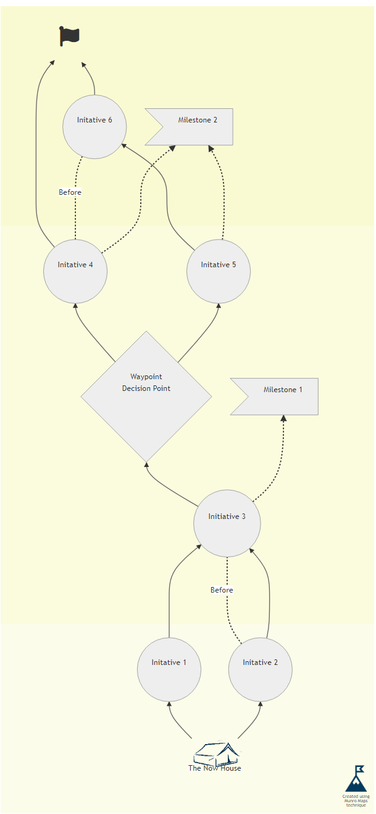

# Munro Maps + mermaidjs





[View Example](https://mermaidjs.github.io/mermaid-live-editor/#/view/eyJjb2RlIjoiZ3JhcGggQlRcblxuJSUgQ3JlYXRlIEluaXRpYXRpdmVzIHdpdGhpbiBIb3Jpem9ucyBcbkxvZ28oLUNyZWF0ZWQgdXNpbmc8YnIvPk11bnJvIE1hcHM8YnIvPnRlY2huaXF1ZS0pXG5zdWJncmFwaCBob3Jpem9uIDEgIFxuXHROb3coLVRoZSBOb3cgSG91c2UtKVxuXHRJbml0YXRpdmUxKChJbml0YXRpdmUgMSkpICBcblx0SW5pdGF0aXZlMigoSW5pdGF0aXZlIDIpKVxuZW5kXG5zdWJncmFwaCBob3Jpem9uIDJcblx0SW5pdGF0aXZlMygoSW5pdGlhdGl2ZSAzKSkgIFxuXHRXYXlwb2ludDF7V2F5cG9pbnQ8YnIvPkRlY2lzaW9uIFBvaW50fSAgXG5cdEluaXRhdGl2ZTQoKEluaXRhdGl2ZSA0KSkgIFxuXHRJbml0YXRpdmU1KChJbml0YXRpdmUgNSkpICBcblx0TWlsZXN0b25lMT5NaWxlc3RvbmUgMV1cbmVuZCBcbnN1YmdyYXBoIGhvcml6b24gMyAgXG5cdEluaXRhdGl2ZTYoKEluaXRhdGl2ZSA2KSkgXG5cdE1pbGVzdG9uZTI-TWlsZXN0b25lIDJdICBcblx0R29hbCgtZmE6ZmEtZmxhZy0pXG5lbmRcblxuJSUgTGluayBJbml0aWF0aXZlcyBcbk5vdyAtLT4gSW5pdGF0aXZlMVxuTm93IC0tPiBJbml0YXRpdmUyXG5Jbml0YXRpdmUxIC0tPiBJbml0YXRpdmUzXG5Jbml0YXRpdmUyIC0uIEJlZm9yZSAuLSBJbml0YXRpdmUzXG5Jbml0YXRpdmUyIC0tPiBJbml0YXRpdmUzXG5Jbml0YXRpdmUzIC0tPiBXYXlwb2ludDFcbkluaXRhdGl2ZTMgLS4tPiBNaWxlc3RvbmUxXG5XYXlwb2ludDEgLS0-IEluaXRhdGl2ZTRcbldheXBvaW50MSAtLT4gSW5pdGF0aXZlNVxuSW5pdGF0aXZlNSAtLT4gSW5pdGF0aXZlNlxuSW5pdGF0aXZlNCAtLT4gR29hbFxuSW5pdGF0aXZlNCAtLiBCZWZvcmUuLSBJbml0YXRpdmU2XG5Jbml0YXRpdmU0IC0uLT4gTWlsZXN0b25lMlxuSW5pdGF0aXZlNSAtLi0-IE1pbGVzdG9uZTJcbkluaXRhdGl2ZTYgLS0-IEdvYWxcblxuJSUgSHlwZXJsaW5rcyB0byB5b3VyIEdvYWwgYW5kIEluaXRpYXRpdmUgZGVmaW5pdGlvbnNcbmNsaWNrIEdvYWwgXCJodHRwczovL2RvY3MubXVucm9tYXBzLmNvbS5hdS9zdHJhdGVneS90aGUtcHJvY2Vzcy9zbWFydC1nb2FsXCJcbmNsaWNrIE5vdyBcImh0dHBzOi8vZG9jcy5tdW5yb21hcHMuY29tLmF1L3N0cmF0ZWd5L3Byb2R1Y3QtbXVucm8tbWFwcy90aGUtbm93LWhvdXNlXCJcbmNsaWNrIEluaXRhdGl2ZTEgXCJodHRwczovL2RvY3MubXVucm9tYXBzLmNvbS5hdS9zdHJhdGVneS9wcm9kdWN0LW11bnJvLW1hcHMvd2hhdC1pcy1hLW11bnJvLWNhcmRcIlxuY2xpY2sgTWlsZXN0b25lMSBcImh0dHBzOi8vZG9jcy5tdW5yb21hcHMuY29tLmF1L3N0cmF0ZWd5L3Byb2R1Y3QtbXVucm8tbWFwcy93aGF0LWlzLWEtbXVucm8tbWlsZXN0b25lXCJcbmNsaWNrIFdheXBvaW50MSBcImphdmFzY3JpcHQ6d2luZG93LmNsb3NlKCk7YWxlcnQoJ01ha2UgYSBkZWNpc2lvbiBoZXJlIGJhc2VkIG9uIGRhdGEgZnJvbSBNaWxlc3RvbmUxJyk7XCJcblxuJSUgU3R5bGUgKEluY2x1ZGVkIE1lcm1haWQgQ29uZmlndXJhdGlvbilcbmNsYXNzIExvZ28gbG9nb1N0eWxlXG5jbGFzcyBHb2FsIGdvYWxTdHlsZVxuY2xhc3MgTm93IG5vd1N0eWxlIiwibWVybWFpZCI6eyJ0aGVtZSI6Im5ldXRyYWwiLCJ0aGVtZUNTUyI6Ii5jbHVzdGVyIHRleHQgeyAgdmlzaWJpbGl0eTogaGlkZGVuOyB9IC5jbHVzdGVyIHJlY3QgeyB3aWR0aDogMTAwMDAwcHg7IGhlaWdodDogMTAwMDAwcHg7IHg6IC01MDAwcHg7IHN0cm9rZTogbm9uZSAhaW1wb3J0YW50OyB9IC5jbHVzdGVyOm50aC1jaGlsZCgzKSA-ICogeyBmaWxsOiAjZmNmY2VhICFpbXBvcnRhbnQ7IH0gIC5jbHVzdGVyOm50aC1jaGlsZCgyKSA-ICogeyBmaWxsOiAjZmJmYmRlICFpbXBvcnRhbnQ7IH0gLmNsdXN0ZXI6bnRoLWNoaWxkKDEpID4gKiB7IGZpbGw6ICNmYWZhZDIgIWltcG9ydGFudDsgfSAubm9kZSBkaXYgeyB0ZXh0LWFsaWduOiBjZW50ZXIgfSAuZ29hbFN0eWxlIGVsbGlwc2UgeyB2aXNpYmlsaXR5OiBoaWRkZW47IH0gLmdvYWxTdHlsZSBmb3JlaWduT2JqZWN0ID4gZGl2ID4gaSB7IGZvbnQtc2l6ZTogMjhwdDsgfSAubm93U3R5bGUgZWxsaXBzZSB7IHZpc2liaWxpdHk6IGhpZGRlbjsgfSAubm93U3R5bGUgZm9yZWlnbk9iamVjdCB7IGJhY2tncm91bmQtaW1hZ2U6IHVybChodHRwczovL211bnJvbWFwcy5maWxlcy53b3JkcHJlc3MuY29tLzIwMTgvMTAvdGhlX25vd19ob3VzZS5wbmcpOyBiYWNrZ3JvdW5kLXJlcGVhdDogbm8tcmVwZWF0OyBiYWNrZ3JvdW5kLXNpemU6IDEwMHB4OyBoZWlnaHQ6IDEwMHB4ICFpbXBvcnRhbnQ7IHdpZHRoOiAxMDBweCAhaW1wb3J0YW50OyB9IC5ub3dTdHlsZSBmb3JlaWduT2JqZWN0ID4gZGl2IHsgcG9zaXRpb246IHJlbGF0aXZlOyB0b3A6IDUwcHg7IH0gLm5vZGUgeyB0ZXh0LWFsaWduOiBjZW50ZXI7fSAubG9nb1N0eWxlIGVsbGlwc2UgeyB2aXNpYmlsaXR5OiBoaWRkZW47IH0gLmxvZ29TdHlsZSBmb3JlaWduT2JqZWN0IHsgYmFja2dyb3VuZC1pbWFnZTogdXJsKGh0dHBzOi8vbXVucm9tYXBzLmZpbGVzLndvcmRwcmVzcy5jb20vMjAxOC8xMC9sb2dvLnBuZyk7IGJhY2tncm91bmQtcmVwZWF0OiBuby1yZXBlYXQ7IGJhY2tncm91bmQtc2l6ZTogNTBweDsgaGVpZ2h0OiA1MHB4ICFpbXBvcnRhbnQ7IHdpZHRoOiA1MHB4ICFpbXBvcnRhbnQ7IHg6MTBweDsgeTozMHB4OyB9IC5sb2dvU3R5bGUgZm9yZWlnbk9iamVjdCA-IGRpdiB7IGZvbnQtc2l6ZTogNnB0OyBwb3NpdGlvbjogcmVsYXRpdmU7IGxpbmUtaGVpZ2h0OiA2cHQ7IHRvcDogNDBwdDsgbGVmdDogMHB0OyB9IiwiZmxvd2NoYXJ0Ijp7ImN1cnZlIjoiYmFzaXMifX19) - make sure to click on the Initiatives! 





```text
graph BT

%% Create Initiatives within Horizons 
Logo(-Created using<br/>Munro Maps<br/>technique-)
subgraph horizon 1  
	Now(-The Now House-)
	Initative1((Initative 1))  
	Initative2((Initative 2))
end
subgraph horizon 2
	Initative3((Initiative 3))  
	Waypoint1{Waypoint<br/>Decision Point}  
	Initative4((Initative 4))  
	Initative5((Initative 5))  
	Milestone1>Milestone 1]
end 
subgraph horizon 3  
	Initative6((Initative 6)) 
	Milestone2>Milestone 2]  
	Goal(-fa:fa-flag-)
end

%% Link Initiatives 
Now --> Initative1
Now --> Initative2
Initative1 --> Initative3
Initative2 -. Before .- Initative3
Initative2 --> Initative3
Initative3 --> Waypoint1
Initative3 -.-> Milestone1
Waypoint1 --> Initative4
Waypoint1 --> Initative5
Initative5 --> Initative6
Initative4 --> Goal
Initative4 -. Before.- Initative6
Initative4 -.-> Milestone2
Initative5 -.-> Milestone2
Initative6 --> Goal

%% Hyperlinks to your Goal and Initiative definitions
click Goal "https://docs.munromaps.com.au/strategy/the-process/smart-goal"
click Now "https://docs.munromaps.com.au/strategy/product-munro-maps/the-now-house"
click Initative1 "https://docs.munromaps.com.au/strategy/product-munro-maps/what-is-a-munro-card"
click Milestone1 "https://docs.munromaps.com.au/strategy/product-munro-maps/what-is-a-munro-milestone"
click Waypoint1 "javascript:window.close();alert('Make a decision here based on data from Milestone1');"

%% Style (Included Mermaid Configuration)
class Logo logoStyle
class Goal goalStyle
class Now nowStyle
```



```javascript
{
  "theme": "neutral",
  "themeCSS": ".cluster text {  visibility: hidden; } .cluster rect { width: 100000px; height: 100000px; x: -5000px; stroke: none !important; } .cluster:nth-child(3) > * { fill: #fcfcea !important; }  .cluster:nth-child(2) > * { fill: #fbfbde !important; } .cluster:nth-child(1) > * { fill: #fafad2 !important; } .node div { text-align: center } .goalStyle ellipse { visibility: hidden; } .goalStyle foreignObject > div > i { font-size: 28pt; } .nowStyle ellipse { visibility: hidden; } .nowStyle foreignObject { background-image: url(https://munromaps.files.wordpress.com/2018/10/the_now_house.png); background-repeat: no-repeat; background-size: 100px; height: 100px !important; width: 100px !important; } .nowStyle foreignObject > div { position: relative; top: 50px; } .node { text-align: center;} .logoStyle ellipse { visibility: hidden; } .logoStyle foreignObject { background-image: url(https://munromaps.files.wordpress.com/2018/10/logo.png); background-repeat: no-repeat; background-size: 50px; height: 50px !important; width: 50px !important; x:10px; y:30px; } .logoStyle foreignObject > div { font-size: 6pt; position: relative; line-height: 6pt; top: 40pt; left: 0pt; }",
  "flowchart": {
    "curve": "basis"
  }
}
```







