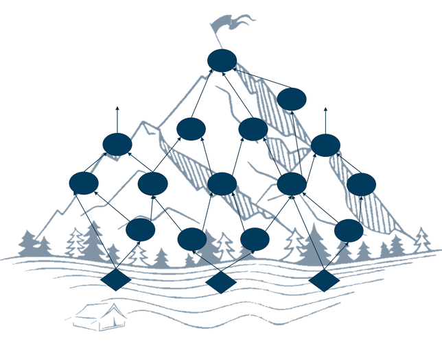
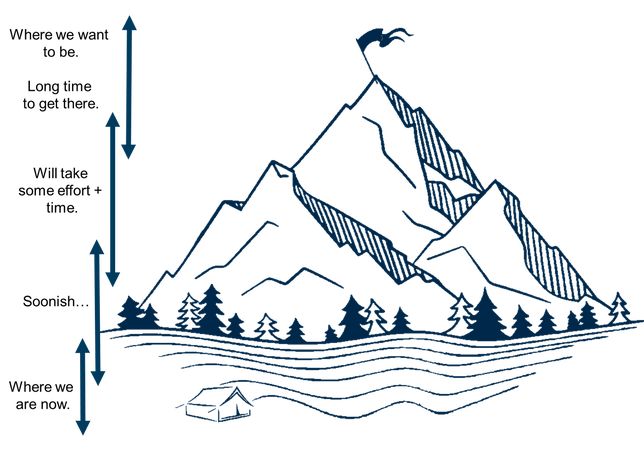

# What is a Munro Map?

The book ["Product Leadership: How Top Product Managers Launch Awesome Products and Build Successful Teams" by Banfield, Eriksson, and Walkingshaw](https://books.google.com.au/books?id=UrbZDgAAQBAJ&vq=gantt&source=gbs_navlinks_s), has a section within it that reads: 

What is not a road map...

* It is not a release plan—leave out specific dates and timelines.
* It is not a list of features and/or components, nor should it include job stories, user stories, or "jobs to be done"; these are too granular for a road-map.
* It is not a commitment. It is a living guide that reacts to new information•It is not one monolithic document. Given that we argue for small, autonomous, cross-functional teams focused on specific areas of the product there should be a road map per team.
* A successful road map is not a Gantt chart. Waterfall connections \(dependencies\) won't work for this level of planning.

There are many products out there that there sole job is to create a road map. However, almost all of them  fail to actually be a road map. They have dates and timelines. They look like Gantt charts. They are waterfall tools trying to make it in an agile world. 

Munro Maps looks at the road map more like, well, a road map. If you are travelling from point A to point B there are many options along the way, milestones to see, decisions to make, data to capture \(direction, speed, happiness of the travellers, etc\). Why should a product \(or project, or company\) road map be any different. 

Munro Maps use the concept of mountains \(see [What is a Munro?](../scottish-munros/what-is-a-munro.md)\) to create a sense of urgency and direction. We start at the bottom of the mountain at the base camp \(or [The "Now House"](../the-mechanics/the-now-house.md)\) and we want to get to [our destination](../the-process/1.-identify-the-destination.md) at the top - [our goal](../the-mechanics/smart-goal.md). 

As a team working on a product \(or project or within a company\) we want to succeed. We want to reach the goal \(see [What is Munro Bagging?](../scottish-munros/what-is-munro-bagging.md)\). By creating a directed graph to represent the mountain we can create nodes - representing initiatives - and vertices - representing dependency, relative-time and estimated-length of the initiative or whatever suits your business or road map's purpose.

By using familiar agile techniques of cards \(see [What is a Munro Card?](../the-mechanics/what-is-a-munro-card.md)\) and walls - yes physical things - we can create a Munro Map within a few hours. 

From the research I have conducted and presenting this at a number of conferences and workshops the outcomes are far beyond those of "traditional road mapping techniques". Participants are able to create a road map quickly and with great detail, through collaboration and communication \([Individuals and Interactions Over Processes and Tools](https://agilemanifesto.org/)\). 

