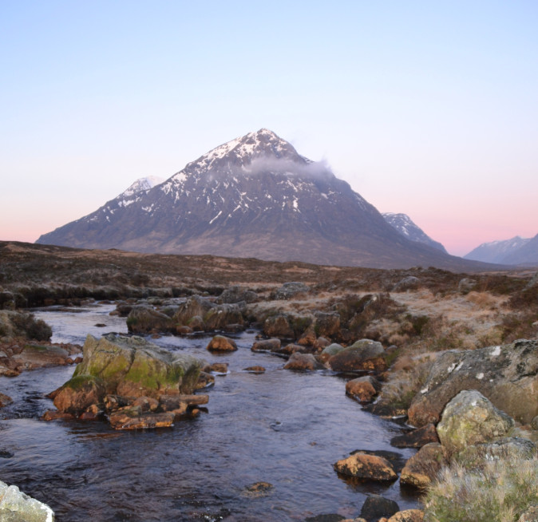

# What is a Munro?

A Munro is a mountain in Scotland with a height over 3,000 feet \(914 m\).

Munros are named after Sir Hugh Munro, who produced the first list of such mountains, known as Munro’s Tables, in 1891.

