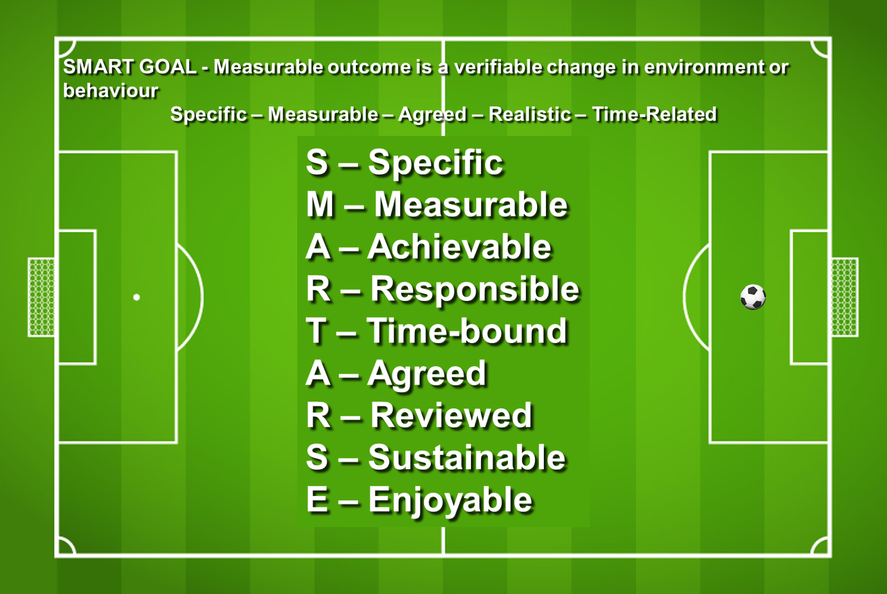

# Goal



 [https://www.linkedin.com/pulse/why-i-stopped-using-product-roadmaps-switched-itamar-gilad/](https://www.linkedin.com/pulse/why-i-stopped-using-product-roadmaps-switched-itamar-gilad/)

### Goals

> “If you tell people where to go, but not how to get there, you’ll be amazed at the results” — George S. Patton.

Most strategy plans commit a cardinal sin — they specify solutions \(use technology X, partner with company Y, launch country Z\) rather than goals. Any modern army general will tell you this is backwards — you give the troops objectives and let them figure out ways to accomplish them \(the principle of [Mission Command](https://www.google.com/url?q=https://en.wikipedia.org/wiki/Mission_command&sa=D&ust=1517339886533000&usg=AFQjCNFlxQf6OsCDzxZMMg-pcz33sV3CVA)\). This method is more empowering, requires less managerial overhead and is far more robust — solutions may come and go based on the situation in the field, but the objectives stay the same.

Goals embody this principle — they describe the company strategy in terms of desired outcomes: where we want to be, by when, and how will we know that we got there. Whenever anyone in the org is is wondering “why are we doing this project?” a goal should give the answer. I became most familiar with goals at Google where every quarter we meticulously spelled out our goals in the form of [Objectives and Key Results](https://www.google.com/url?q=https://rework.withgoogle.com/guides/set-goals-with-okrs/steps/introduction/&sa=D&ust=1517339886534000&usg=AFQjCNFcMmXatcq6fBQAthzzdN3KV94PFg) \(OKRs\). Some believe that OKRs are one of the reasons for Google’s was so successful. 

Goals are typically set for an horizon of one or more years — this is where we want to encourage long-term thinking. They are defined at the beginning of the year and evaluated and adjusted every quarter — we don’t want to pursue stale goals.

* Goals rather than solutions and vague strategy statements.

