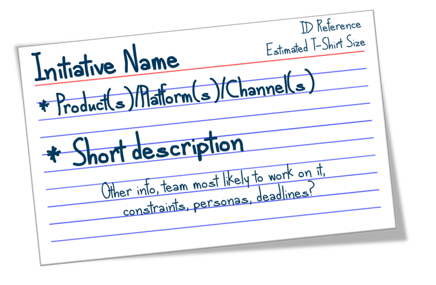

# What is a Munro Card?

A typical Munro Card is system card that is used during the road mapping workshop. The details of the card are up to you and the context your are working in.

Below is an example of the front-side of a Munro Card. Basic information includes: 

* An ID reference 
* The initiative name
* Estimated size \(usually T-Shirt sizes when estimating large things into the future\)
* A short description \(keep longer descriptions somewhere that everyone can access, e.g. a wiki\)
* The product\(s\), platform\(s\), or channel\(s\) that the initiative _may_ involve.
* And any other information that makes the process of putting the card within a map easier, e.g. a deadline or other constraints. 

The back of the Munro Card can incorporate other notes that you may identify during the process. These notes are not as important to know during the process of creating the Munro Map but will be important later on. Information could include things like:

* Metrics
* Definition of done
* Acceptance criteria
* Risks
* Assumptions
* Issues
* Dependencies
* Or any other notes that you capture during the workshop.

You could also use a the Goal Oriented Product Roadmap \(GO Product Roadmap\) template from Roman Pichler. [https://www.romanpichler.com/blog/goal-oriented-agile-product-roadmap/](https://www.romanpichler.com/blog/goal-oriented-agile-product-roadmap/)

