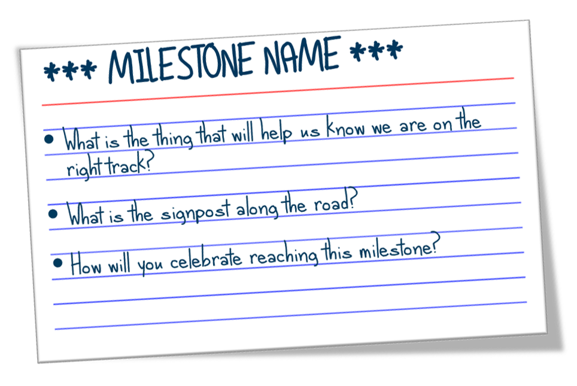

# What is a Munro Milestone?

A milestone is a not a goal or outcome but shows that you are on the right track to achieving the goals and outcomes. 

For example...

* Alignment with &lt;Group X&gt; over &lt;Y&gt; achieved. 
* Successfully engaged &lt;Group X&gt;

