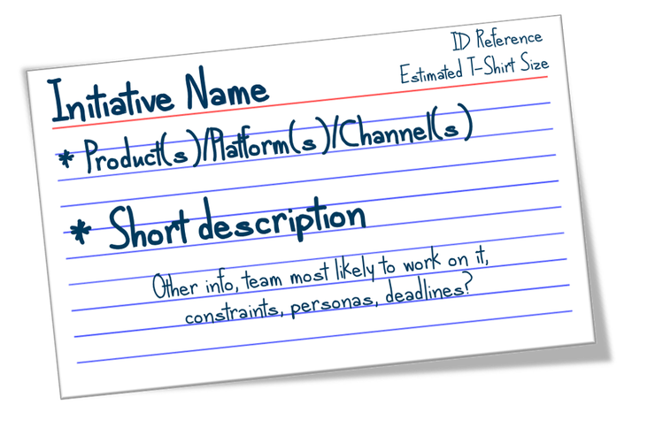

# 3. Create Munro cards

Identify the journey elements 

* Once you have identified your destination and your rationale you can then brainstorm ways and means to achieve the outcome
* Don’t look at it linearly – just identify the elements that need to be in place
* Start with Nouns - List the names of all the things that need to be touched / influenced / changed by the journey
* Verbs are the key - Bloom’s Taxonomy Action Verbs

Create your Munro Cards!

* Initiative Name -&gt; Verb + Noun
* What products / platforms / channels are involved?
* What team might work on it?
* Known constraints?
* Known personas involved?
* Known deadlines?

