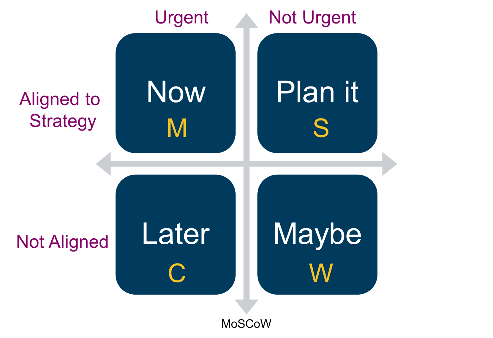

# 5. Prioritise

[https://www.linkedin.com/pulse/why-prioritization-impacteffort-doesnt-work-itamar-gilad/](https://www.linkedin.com/pulse/why-prioritization-impacteffort-doesnt-work-itamar-gilad/)

#### **The tendency to underestimate effort**

In 1979 behavioral psychologists Daniel Kahneman and Amos Tversky described the phenomenon they called [Planning Fallacy](https://en.wikipedia.org/wiki/Planning_fallacy). They showed that people and teams are consistently overly optimistic about how much time it will take them to complete a future task, underestimating the actual time required to do so. This phenomena has since been confirmed in many different studies. 

If you’ve worked in tech for any amount of time this will not come as a huge shock. Tasks and projects regularly run over compared to the plan and it’s not uncommon to have x2-x3 time overruns \(and sometimes much more\). Experienced engineering leads and project managers are adept at padding estimations, adding project buffers, or just multiplying everything by two, and still almost no projects or task finish, ahead of time, very few projects on time and most run over \([example](http://money.cnn.com/interactive/technology/kickstarter-projects-shipping/)\).

There are several reason for this, most having to do with[ cognitive biases](https://en.wikipedia.org/wiki/Cognitive_bias):

* [Optimism](https://en.wikipedia.org/wiki/Optimism_bias) and wishful thinking
* Inaccurate recollection of the time past similar tasks took.
* Over focus on execution and completion
* Underestimation of the occurrence of random events
* Scaling issues - as the size of the project increases our ability to accurately project its duration further decreases.

#### **The tendency to overestimate impact**

In 2003, Kahneman and Lovallo extended the definition of Planning Fallacy to include the tendency to underestimate the time, costs, and risks of future actions and at the same time _overestimate_ the benefits of the same actions. In other words our bad projections result not just in time overruns, but also in cost overruns and _benefit shortfalls_.

In tech we’re somehow blissfully unaware of this. Time after time I see managers and teams trusting their gut feeling when assessing future impact, irrespective of how well past predictions performed in reality. The two main contributing factors are:

* No clear metrics - often whether a project or task were successful or not is a matter of interpretation because no success criteria was specified in advance.
* We tend to remember our good predictions and forget the bad ones \(or attribute them to others\).

Once systematic measurements of success/failure are in place we get a clear, and very sobering, pictures of how little we can predict impact. Analyses of A/B experiments conducted independently by Microsoft, Netflix, Booking.com and other companies had shown that at best 1 in 3 ideas tested created any measurable positive results. The other ideas tested yielded in either no impact or in negative impact \(!\). In fact 1 winning idea in 3 should be considered a very good result which is typical of mature products and companies that have spent a good amount of time researching their users. Your typical startup project will probably yield 1-in-10 ratio or worse.

> _“It is humbling to see how bad experts are at estimating the value of features \(us included\). Every feature built by a software team is built because someone believes it will have value, yet many of the benefits fail to materialize.”_ [_Microsoft research paper_](http://ai.stanford.edu/~ronnyk/ExPThinkWeek2009Public.pdf) _, 2009_

