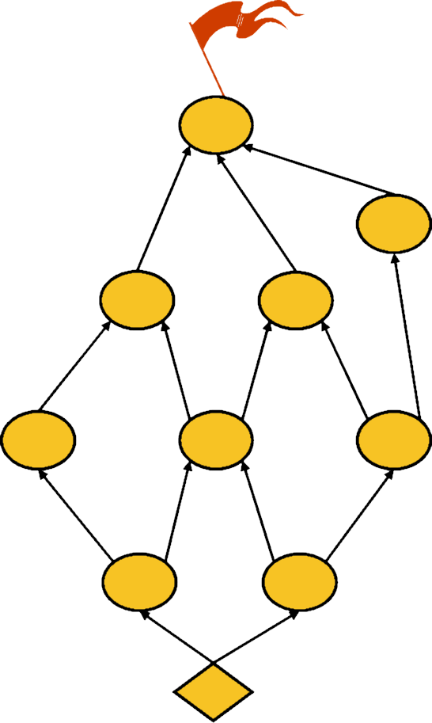

# 6. Devise a route

Start creating your Munro Map!

Start by placing your goal at the top.

Place Sub-Goals under main goal

Then go to the bottom and set up the current state.

Ask “Which initiative can help us move from here to the nearest goal?” – repeat

* Start by placing your goal at the top.
* Place Sub-Goals under main goal
* Then go to the bottom and set up the current state.
* Ask “Which initiative can help us move from here to the nearest goal?” – repeat

Start by placing your goal at the top.

Place Sub-Goals under main goal

Then go to the bottom and set up the current state.

Ask “Which initiative can help us move from here to the nearest goal?” – repeat

